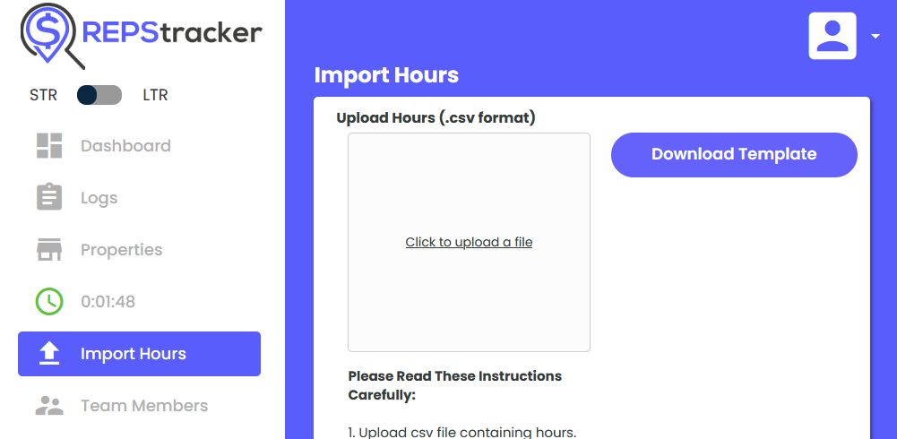

# Scripts for Collecting RemoteLock Data on STR Team Member Activity

This is a collection of python scripts that can be used to collect durations of
team member activity from RemoteLock lock event data. It uses an unpublished 
RemoteLock API for data collection, then filters and summarizes the data for 
the team member in question. This data is then used to 
prepare a CSV that can be consumed by REPStracker to record events for your 
team members.

These scripts may also be useful to you even if you don't use REPStracker. The 
final output of these scripts is a CSV file, which can instead be opened in 
Excel or just kept in your records.

**WARNING: REPStracker does not seem to support updating via CSV import. (i.e. 
upsert) Before uploading the output to REPStracker, ensure that you will not be 
creating duplicate entries.**

## Installation

These are Python 3.x scripts, and therefore they require Python to be 
installed. Virtualenvs are optional, but recommended.

1. Clone this repository, or download the files.
1. Create a virtualenv: `python -m virtualenv env`
1. Activate the virtualenv:
    - Windows: `.\env\Scripts\activate.ps1` (PowerShell) or `.\env\Scripts\activate.bat` (cmd)
    - Mac/Linux: `source ./env/bin/activate`
1. Install requirements: `pip install -r ./requirements.txt`

## Collecting Data

There are five scripts to be run in sequence:

1. `collect.py` collects all of the lock data for a specified lock.
1. `filter.py` filters the events to the events that are relevant to the user in question.
1. `summarize.py` summarizes the output of `filter.py` by calculating the difference in times from unlock to final lock.
1. `summarize.py` prepares a CSV file that can be uploaded to REPStracker.
1. `archive.py` saves all intermediate files in a zip file, stripping sensitive data

I recommend that you retain the intermediate files used by these scripts in your records. `archive.py` will create a zip archive of the intermediate files. **Save this file in your records.** This guards against the possibility that some logic in the script is incorrect and allows you to fully audit the resulting data should the need arise. Cheap insurance.

**IMPORTANT: This file contains sensitive information. Keep it private.**

### Step 1: `auth.py`

`usage: auth.py [-h] [-e EMAIL] [-o OUTPUT] [-n NAME] [-v] [--version]`

- You may supply your email address as an argument. You will be 
prompted to enter your password for RemoteLock on the command line.

#### Example
```
$ python auth.py --email strpro@example.com
Password: 
Success! You can now run collect.py to collect data from the RemoteLock API.
```

### Step 2: `collect.py`

`usage: collect.py [-h] [-s START] [-d DELAY] [-o OUTPUT] [-q] [-v] [--version] event_page_url pages`

- Before running the script, log in to RemoteLock with your browser and go to the _Events_ page for the lock in question.


- Get the URL from the browser and copy it to your clipboard. It should look something like this: `https://connect.remotelock.com/devices/schlage-home-locks/10ee036c-5cf3-487b-b07b-067747945e20/events`
- Scroll to the bottom of the page, and note the number of event pages that are available: (40 in this example)


- Make sure you have first run auth.py
- Use the quiet flag if you'd like the command to run without output

#### Example
```
$ python .\collect.py https://connect.remotelock.com/devices/schlage-home-locks/601a9e8c-d2a1-483d-8e5b-8450435594d3/events 40
Page 1: 200 OK
Page 2: 200 OK
Page 3: 200 OK
Page 4: 200 OK
Page 5: 200 OK
Page 6: 200 OK
Page 7: 200 OK
Page 8: 200 OK
Page 9: 200 OK
Page 10: 200 OK
Page 11: 200 OK
Page 12: 200 OK
Page 13: 200 OK
Page 14: 200 OK
Page 15: 200 OK
Page 16: 200 OK
Page 17: 200 OK
Page 18: 200 OK
Page 19: 200 OK
Page 21: 200 OK
Page 22: 200 OK
Page 23: 200 OK
Page 24: 200 OK
Page 25: 200 OK
Page 26: 200 OK
Page 27: 200 OK
Page 28: 200 OK
Page 29: 200 OK
Page 30: 200 OK
Page 31: 200 OK
Page 32: 200 OK
Page 33: 200 OK
Page 34: 200 OK
Page 35: 200 OK
Page 36: 200 OK
Page 37: 200 OK
Page 38: 200 OK
Page 39: 200 OK
Page 40: 200 OK
```

### Step 3: `filter.py`

`usage: filter.py [-h] [-i INPUT] [-o OUTPUT] [-v] [--version] username`

- `username` is the RemoteLock username you want to establish presence for
- This script is only responsible for filtering the events; the actual
  calculations happen in the following script

### Example
```
$ python filter.py "My Cleaning Team"
Found 19 events
```

### Step 4: `summarize.py`

`usage: summarize.py [-h] [-d DESCRIPTION] [-a ACTIVITY_GROUP] [-t TEAM_MEMBER] [-i INPUT] [-o OUTPUT] [-c CSV] [-q] [-v] [--version] username property_address`

- **BE CAREFUL AT THIS STEP**
- **You will want to copy/paste values for Property Address and Activity Group to ensure that entries are propertly recorded by REPStracker**
- **Make sure `username` matches EXACTLY to a team member you set up on REPStracker use the `--team_member` argument if it isn't the same as the `username`**
- `Acitivity Group` names are available on the `Import Hours` screen in REPStracker
- Provide the same username used in the last script
- If you use REPStracker, you can upload the CSV file in the web app using the "Import Hours" function
- By default, the CSV file will be in `./rundata/summary.csv`
- You may want to edit the resulting CSV file before uploading to REPStracker; for example, you may want to provide different values for Description or Activity Group

#### Example
```
$ python summarize.py "My Cleaning Team"
Found 22 visits, averaging 102 minutes.
```

### Step 5: `archive.py`


By default, archive.py will save a zip file in the same directory named by
the date you created it. e.g. 

**IMPORTANT: This file contains sensitive information. Keep it private.**

### Step 6: Upload summary.csv to REPStracker




## Issues

These scripts make use of an unpublished API used by the RemoteLock web app 
Unpublished APIs carry no guarantees, and they can change at any time. These 
scripts may stop working due to an API change. Please open a github issue at 
https://github.com/redblacktree/remotelock if you encounter errors.

## Notes/Troubleshooting

### API Changes

In the event that the RemoteLock API changes, request files in the config 
directory may need to be regenerated based on those changes. This file is 
generated by `setupscripts/extracthar.py`.

JSON request configuration files are included in the repository, and you 
should generally not need to re-generate them. I include this information so 
that you are empowered to fix these scripts if/when I abandon this project.

### RemoteLock Cookies

Running of `colect.py` requires you to supply your authentication cookie. You 
can use the "inspector" or "dev tools" in your browser to inspect network 
traffic and retreive this cookie. It will look something like this:

`_remotelock_production_web_session: s:-JRef5UZCi7o-QJ1YirvYVfoIEimmDwV.Ld9Gg9cKHOe/x44IMlkuhVTmbqmpm0TAHb4wEaus2js`

### Unnecessary Steps

These scripts could relatively easily be combined into a single script. I haven't done that for several reasons:

- I want to save intermediate files for my records, and for debugging
- I want to limit requests to the RemoteLock API. Since we're using an unpublished API, it pays to be good citizens; I don't want to cause problems for the administrators.
- If errors happen when running scripts, you don't have to start over from the beginning. (see above point about API usage)
- Smaller scripts are easier to read and reason about